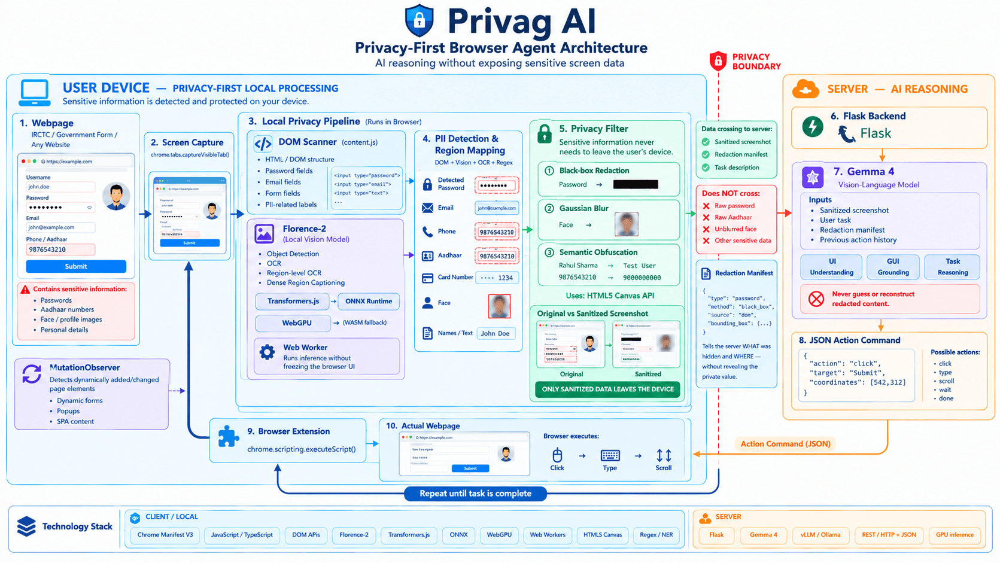
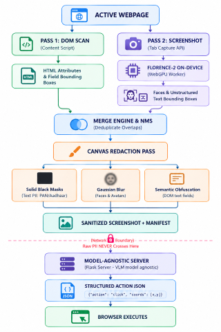

# Privag AI — On-Device PII Firewall for Browser Agents

> **PRIVAG** = **PRIV**acy **AG**ent · An on-device PII firewall for browser agents (Chrome + Firefox)  
> _Smart India Hackathon 2026 | Problem Statement: SIH26171 | Organization: ISRO_  
> **Team:** ByteHackerz — Indian Institute of Technology (IIT) Bhilai

[](https://sih.gov.in)
[](https://isro.gov.in)
[](#)
[](#)
[](#)

---

## 📌 Executive Summary

Modern AI browser agents stream raw, unredacted screen captures directly to cloud foundation models. In doing so, passwords, Aadhaar cards, PAN numbers, banking tokens, and private faces leave the user's computer, irreversibly violating privacy.

**Privag AI** introduces a lightweight, privacy-by-architecture solution for browser automation:

1. **On-Device Sanitization**: All Personally Identifiable Information (PII) is detected and redacted **locally in the browser** before any network request is made.
2. **Redaction-Aware Reasoning**: A companion **Redaction Manifest** informs the upstream Vision-Language Model (VLM) of _what_ functional elements exist without ever exposing the underlying private values.
3. **Action Execution Loop**: The server returns grounded, structured actions (`click`, `type`, `scroll`, `wait`) that the browser executes autonomously.

---

## 💡 Engineering Philosophy: "Minimal AI by Design"

Rather than lazily outsourcing privacy detection to expensive, non-deterministic cloud LLMs, Privag AI is engineered from **first principles**:

> **"If code can solve it deterministically, code solves it. AI is invoked only where code cannot reach."**

```
┌────────────────────────────────────────────────────────────────────────┐
│                        PRIVAG PRIVACY PRINCIPLE                        │
├──────────────────────────┬─────────────────────────┬───────────────────┤
│ 1. Form Passwords & PII  │ Handcoded DOM Traversal │ <20ms, 100% Recall│
│ 2. Visual Redactions     │ Native HTML5 Canvas 2D  │ Zero AI Overhead  │
│ 3. Unstructured Faces/OCR│ On-Device WebGPU Model  │ Zero Cloud Data   │
│ 4. Next-Action Reasoning │ Model-Agnostic VLM      │ Blind to Secrets  │
└──────────────────────────┴─────────────────────────┴───────────────────┘
```

- **No unnecessary compute:** 100% of standard form fields (`input[type="password"]`, email, phone, card numbers) are identified in **under 20 milliseconds** via deterministic DOM scanning.
- **Pure graphics math for redaction:** Gaussian blurs and black-box masks are rendered directly using the browser's native Canvas 2D engine.
- **On-device AI only where essential:** Florence-2 runs locally inside the browser via WebGPU (with an automatic WebAssembly/WASM CPU fallback on unsupported devices) to detect visual human faces and unstructured text rendered inside images or banners.

---

## 🏗️ System Architecture



### The Dual-Pass Pipeline



---

## 🎥 Prototype Demonstration

<video src="assets/demo.mp4" controls="controls" width="100%"></video>

*(Standalone video file: [`assets/demo.mp4`](assets/demo.mp4))*

---

## ⚡ Hardware Benchmarks

All benchmarks measured locally on a consumer-grade laptop (Intel Core i5 10th Gen, NVIDIA GeForce GTX 1650 4GB VRAM, 8GB RAM, Windows 11):

| Model Component                        |  Runtime Backend  |     Latency      |     Detection Capability     | Target Role                       |
| :------------------------------------- | :---------------: | :--------------: | :--------------------------: | :-------------------------------- |
| **Florence-2 On-Device Vision**        | In-Browser WebGPU | **3.18 seconds** | Visual Text & Face Detection | Zero-knowledge client perception  |
| **Deterministic DOM Scanner**          | Content Script JS |   **< 20 ms**    |   100% on HTML Form Fields   | Instantaneous client form masking |
| **Upstream Server VLM (`gemma4:31b`)** |    Gemini API     | **~1.2 seconds** |  Redaction-Aware Reasoning   | Next-action planning & execution  |

### Benchmark Highlights:

- **Zero Cloud Vision Overhead:** Privacy filtering happens completely on client silicon before any network packet is dispatched.
- **Single-Pass Face Merging:** Overlapping multi-token detections (eyes, head, person) are dynamically merged via bounding union to produce a clean, unified Gaussian blur.
- **Graceful Degradation:** Runs with hardware-accelerated WebGPU by default; automatically falls back to 4-bit quantized WASM execution if GPU access is restricted.

---

## 🛡️ Three Redaction Modalities

Privag AI matches the redaction technique to the sensitivity and semantic nature of the data:

1. **Solid Black-Box Masking (`black_box`):**
   - Applied to text PII (passwords, PAN card, Aadhaar numbers, phone numbers).
   - Generates high-contrast redactions with metadata tags (`• REDACTED (aadhaar)`).
2. **True Gaussian Blur (`gaussian_blur`):**
   - Applied to human faces, profile pictures, and biometric photos.
   - Rendered using native Canvas filtering (`ctx.filter = 'blur(14px)'`) with strict clipping bounds.
3. **Semantic Obfuscation (`semantic_mock`):**
   - Synthetic placeholder substitution in DOM contexts (e.g. replacing real email with `demo.user@privacy.org`), maintaining functional page structure while stripping true identity.

---

## 📊 Alignment with SIH Evaluation Criteria

| Evaluation Metric                    | Weight  | Privag AI Implementation                                                                                                                                                   |
| :----------------------------------- | :-----: | :------------------------------------------------------------------------------------------------------------------------------------------------------------------------- |
| **Visual Context Accuracy**          | **25%** | Redaction Manifest sends structured element coordinates, DOM tags, and visible buttons alongside the image so the VLM maintains full context without seeing raw PII.       |
| **PII Detection Recall & Precision** | **20%** | Dual-pass synergy: DOM scan achieves 100% precision on HTML form fields, while on-device Florence-2 catches unstructured visual text and human faces on the rendered page. |
| **Redaction Precision**              | **20%** | Native Canvas 2D engine with safety padding (`padX: 4, padY: 3`) prevents boundary bleed and ensures 100% occlusion of sensitive text tokens.                              |
| **Client-Side Resource Usage**       | **20%** | First-principles engineering minimizes AI invocations. DOM scan runs in $<20\text{ms}$ with 0 MB VRAM; Florence-2 leverages browser hardware acceleration via WebGPU.      |
| **End-to-End Latency**               | **15%** | DOM filtering provides instantaneous client masking; on-device Florence-2 completes client vision in $\approx 3.18\text{s}$ on standard consumer hardware.                    |

---

## 📚 Project Documentation

Detailed technical guides, architectural specifications, and hardware evaluation data are documented inside the [`docs/`](docs/) directory:

| Document                                              | Description                           | Key Focus Areas                                                                                                 |
| :---------------------------------------------------- | :------------------------------------ | :-------------------------------------------------------------------------------------------------------------- |
| 🏗️ **[`docs/ARCHITECTURE.md`](docs/ARCHITECTURE.md)** | **System Architecture & Data Flow**   | Zero-knowledge client boundary, Dual-Pass pipeline, Redaction Manifest schema, and upstream VLM grammar.        |
| 🔌 **[`docs/API.md`](docs/API.md)**                   | **Server Integration & API Contract** | Complete endpoint specifications (`/api`, `/api/step`, `/model/info`), JSON schemas, and client fetch snippets. |
| ⚡ **[`docs/BENCHMARKS.md`](docs/BENCHMARKS.md)**     | **Hardware Benchmarks & Profiles**    | Latency measurements, RAM/VRAM footprints, WebGPU vs WASM runtime, and PII recall rates across modalities.      |
| 🎯 **[`docs/EVALUATION.md`](docs/EVALUATION.md)**     | **SIH Evaluation Alignment Matrix**   | Direct mapping demonstrating how Privag AI satisfies all 5 ISRO evaluation criteria with concrete numbers.      |

---

## 🚀 Quickstart Guide

### 1. Server Setup (Python Flask)

```powershell
cd server
python -m venv .venv
.\.venv\Scripts\activate
pip install -r requirements.txt
python app.py
```

- Server runs on `http://127.0.0.1:5000`
- Management dashboard accessible at `http://127.0.0.1:5000/`

### 2. Standalone Vision Engine & Benchmarks (WebGPU)

```powershell
cd client-vision
npm install
npm run build
cd ..
python -m http.server 8080
```

- Open **`http://localhost:8080/client-vision/test.html`** in Google Chrome or Brave. The page runs the extension's own worker build (`extension/florence-worker.bundle.js`), so serve from the repository root.
- Run instant on-device PII detection with WebGPU acceleration.

### 3. Chrome Extension Deployment

1. Build the vision worker into the extension (only needed after changing `client-vision/worker.js` or its dependencies):
   ```powershell
   cd client-vision
   npm install
   npm run build
   ```
   This writes `extension/florence-worker.bundle.js` and copies ONNX Runtime's `ort-wasm-simd-threaded.asyncify.mjs` / `.wasm` next to it. The extension must ship these files: its Content Security Policy blocks loading them from a CDN, which otherwise breaks both WebGPU and the WASM fallback.
2. Open Google Chrome (or Brave) and navigate to `chrome://extensions/` (`brave://extensions/`).
3. Enable **Developer mode** (top right toggle).
4. Click **Load unpacked** and select the `extension/` directory.
5. Pin the **Privag AI** icon and launch the agent on any web form. The first launch downloads the Florence-2 weights (~340 MB); they are cached by the browser afterwards.

---

## 👥 Team Details

- **Team:** ByteHackerz — IIT Bhilai
- **Problem Statement:** SIH26171 — _On-device Visual Perception for Light-weight Browser Agents_
- **Theme:** Smart Automation
- **PS Category:** Software
- **Lead Ministry / Organization:** Indian Space Research Organisation (ISRO)

---

## 📄 License

This project is developed for the Smart India Hackathon 2026 under the MIT License.
