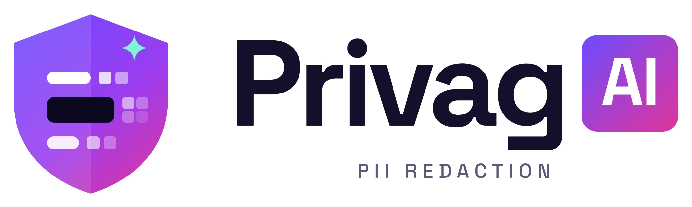
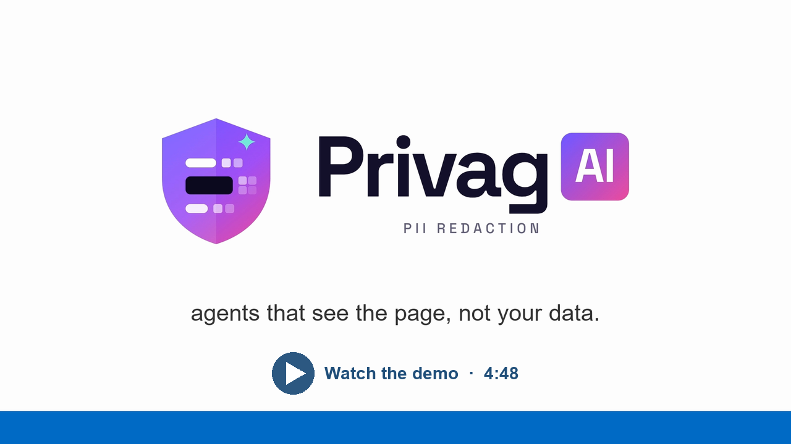

<p align="center">
  <picture>
    <source media="(prefers-color-scheme: dark)" srcset="assets/logo-dark-transparent.png">
    
  </picture>
</p>

<p align="center"><a href="https://youtu.be/d4-FHSMkEp4"></a></p>

# Privag AI — an on-device PII firewall for browser agents

SIH 2026 · **SIH26171** (ISRO): _On-device Visual Perception for Light-weight Browser Agents_ · Team **ByteHackerz**, IIT Bhilai

Privag AI is a browser extension that lets a server-side vision-language model (Gemma 4) operate web pages for you without seeing your personal data. Before every step it finds PII on your device — in the page's DOM with checksum validators, and inside images and frames with the Florence-2 vision model running in the browser — and masks it in the screenshot, the task text and the action history. The server answers with one JSON action, which the extension checks against a local gate (no typing secrets, no leaving the site, your click before submit or pay) and then executes.

## At a glance

|                                                                      | Measured                                                                                                                                              |
| -------------------------------------------------------------------- | ----------------------------------------------------------------------------------------------------------------------------------------------------- |
| Agent tasks with **Gemma 4 31B** (6 tasks × 3 runs on the demo page) | **17 of 18 passed**; no raw PII in any of the 43 requests sent                                                                                        |
| Full agent step with Gemma 4 31B (device + server + model)           | **9.5 s** median, of which vision 2.0 s on a GTX 1650 laptop                                                                                          |
| A step with no new images (vision skipped or reused)                 | **0.43–0.45 s**                                                                                                                                       |
| Client footprint                                                     | 343 MiB model download (once); with vision on every step, peak memory 0.78–1.09 GiB for the extension plus 1.49–1.57 GiB in the browser's GPU process |
| Tests                                                                | 98 unit · 47 server · privacy end-to-end · race · smoke 28/28                                                                                         |

Client: Intel i5-10300H laptop, GTX 1650 4 GB, Brave. Model: Ollama `gemma4:31b` on a server on the local network. Method and raw output: [`docs/BENCHMARKS.md`](docs/BENCHMARKS.md), [`docs/EVALUATION.md`](docs/EVALUATION.md).

## Light-weight: vision only where the DOM can't read

The vision model is the slow part of a step, so it runs only on what the DOM can't read: images, video, canvas, frames and PDFs on screen. None on screen: skipped. Same pixels as a recent step: the earlier result is reused.

| On screen                             | Whole step, median (mock model) |
| ------------------------------------- | ------------------------------- |
| No images                             | 453 ms                          |
| Same images as before                 | 433 ms                          |
| New images, WebGPU                    | 3.40–4.35 s                     |
| New images, CPU only (4 WASM threads) | 29.4 s and 48.6 s               |

## How one step works


1. **Settle:** pause animations, wait until the DOM is still (MutationObserver).
2. **DOM pass:** validators (Aadhaar/Verhoeff, card/Luhn, PAN, phone, UPI, IFSC, email, labelled OTP) and field purposes (`type`, `autocomplete`, labels). A regex match alone never masks.
3. **Screenshot** (`captureVisibleTab`); retaken if the page changed, withheld if it keeps changing. The raw image never leaves the browser.
4. **Vision** (Florence-2, WebGPU, WASM fallback): faces and text, on media regions only.
5. **Mask** on a canvas: black boxes for secrets and IDs, a grey mask for faces, look-alike values (`user_0001@example.com`) for what the agent needs. A manifest `{type, method, source, bbox}` lists every mask.
6. **Server** (Flask → Gemma 4) returns exactly one action: `click`, `type`, `scroll`, `wait`, `ask_user` (asks you for a missing detail) or `done` (ends the task and announces a summary).
7. **Gate and execute** on the device; a placeholder becomes the real value only in the field it belongs to. Repeat until `done`.


The architecture diagram from our submission is above. Where the code differs: faces get a solid grey mask (not a blur), names in free text are not detected yet, and Florence-2 runs detection and OCR only (no dense captioning). Details: [`docs/ARCHITECTURE.md`](docs/ARCHITECTURE.md).

## Try it

**Two minutes, no server needed:**

1. `chrome://extensions` (or `brave://`, `edge://`) → **Developer mode** → **Load unpacked** → `extension/`.
2. From the repository root: `python -m http.server 8080`, then open `http://localhost:8080/demo/` (synthetic data only).
3. Open the Privag side panel, press **Sanitize Only**: you see exactly the masked frame the agent would send.

**Run the agent:** start the server, then enter your model's OpenAI-compatible URL on the setup page it opens (`http://localhost:5000/`).

```powershell
cd server
python -m venv .venv
.\.venv\Scripts\python -m pip install -r requirements.txt
.\.venv\Scripts\python app.py
```

Type a task in the side panel and press **Run Agent**. Settings can also go in `server/.env` (see `server/.env.example`); all options are in [`docs/API.md`](docs/API.md). Firefox 140+: `about:debugging` → **Load Temporary Add-on** → `extension/manifest.json`.

**Tests:** `node --test "tests/unit/*.test.mjs"` · `cd server; .venv\Scripts\python -m unittest discover -s tests` · `cd tests; npm install; npm run test:privacy` · benchmark `node bench/bench.mjs` · task evaluation `node bench/eval.mjs` ([`tests/README.md`](tests/README.md)).

## Feature status

Against the idea submission:

| Feature                                                                                   | Status                                                                    |
| ----------------------------------------------------------------------------------------- | ------------------------------------------------------------------------- |
| One WebExtension, Chrome MV3 + Firefox                                                    | Implemented (tested in Brave and Firefox 157; Chrome and Edge not tested) |
| Screenshot never leaves the browser                                                       | Implemented (privacy test checks the exact bytes sent)                    |
| DOM pass: input types, `autocomplete` tokens, text with boxes                             | Implemented                                                               |
| Validators (Verhoeff, Luhn, PAN, phone, UPI, IFSC); regex alone never masks               | Implemented                                                               |
| MutationObserver; changing pages withheld                                                 | Implemented                                                               |
| Florence-2 via Transformers.js, WebGPU + WASM, Web Worker, media regions only             | Implemented                                                               |
| On-device NER for names in free text                                                      | **Planned** (name _fields_ are masked)                                    |
| Canvas masking: black box, solid mask for faces (not blur), look-alikes                   | Implemented                                                               |
| Fail-closed                                                                               | Implemented                                                               |
| Redaction manifest `{type, method, source, bbox}`                                         | Implemented (schema-checked on both sides)                                |
| Task and history masked with placeholders                                                 | Implemented                                                               |
| Action gate: no password/OTP typing, no off-site navigation, your click before pay/submit | Implemented                                                               |
| Vault: memory only, real values only into their field, cleared when the task ends         | Implemented                                                               |
| Actions via `executeScript`, loop until done, one JSON action per step                    | Implemented (+ `ask_user`, + `done` summary)                              |
| Flask server for Gemma 4 31B via vLLM/Ollama                                              | Implemented (run with Ollama `gemma4:31b`; vLLM not tried)                |
| Model never asked to guess masked content                                                 | Implemented (system prompt rule)                                          |

## Privacy guarantees

- **Pixels:** only the masked JPEG leaves the browser. _Checked by the privacy test, which captures every request byte._
- **Text:** page text, field values, the task, the history and your answers to the agent leave only as placeholders or look-alikes; the manifest allows no other keys. _Privacy test (12 PII strings in every request); Gemma 4 31B evaluation (none in 43 requests)._
- **Placeholders** turn into real values only in the field they came from, or a field of the same kind. _Vault unit tests, smoke tests._
- **Actions:** no typing passwords/OTPs, no leaving the site, your click before pay or submit. _Gate unit tests; in the evaluation the model tried to pay on its own twice and was stopped both times._
- **Fail-closed:** a frame is withheld if the DOM pass can't run, the page won't hold still, vision fails, or the manifest is invalid; unreadable text in frames is blacked out. _Race test._
- **Server:** 127.0.0.1 by default, no CORS, config page local-only, every request and reply validated. _47 server tests._

## Limitations

- Names in free text are not detected yet (on-device NER is planned).
- Text that OCR misses inside an image is not masked (small text in a large image is the usual case).
- Pages that change faster than every 100 ms are withheld, so the agent stops on them.
- Without WebGPU, a step with new images takes tens of seconds (29.0–48.1 s per vision pass on our laptop).
- The model can overreach (it tried to pay unasked); the local gate, not the model, is the guarantee.
- Not yet measured: PII recall/precision on a labelled set, real websites, vLLM, Chrome/Edge.

## Repository

`extension/` the WebExtension · `client-vision/` vision worker source · `server/` Flask server · `tests/` unit, privacy and race tests · `bench/` benchmark, task evaluation, raw results · `demo/` demo page · `docs/` [architecture](docs/ARCHITECTURE.md), [API](docs/API.md), [benchmarks](docs/BENCHMARKS.md), [evaluation](docs/EVALUATION.md)

Developed for Smart India Hackathon 2026 under the MIT License.
